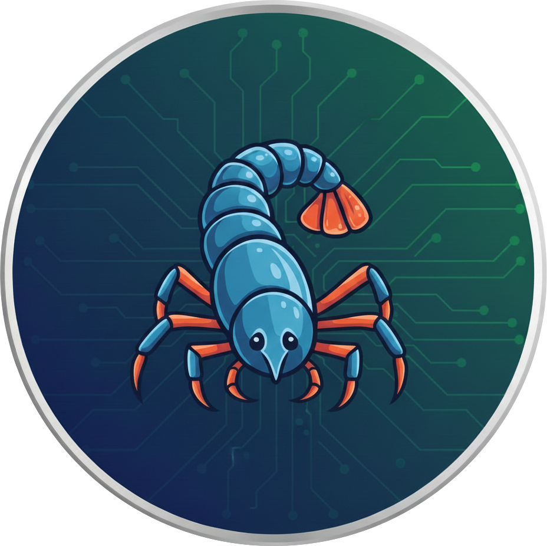

# noclaw

The smallest it can be.

Featuring a truly infinite context window, 100% deterministic output, and literal zero-shot reasoning

## Usage

```
echo "install my dependencies" | python3 noclaw.py
```
Or interactively:

```
python3 noclaw.py
```
